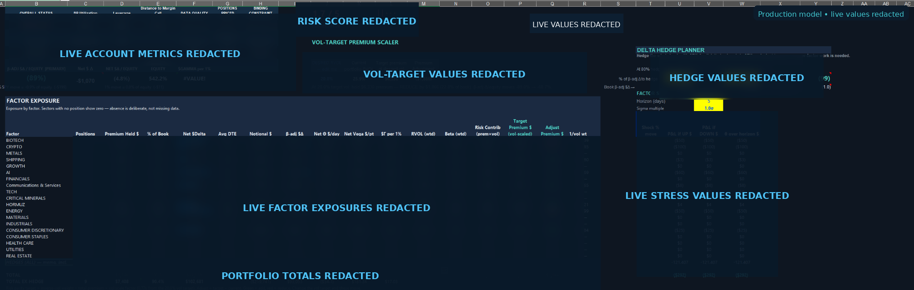
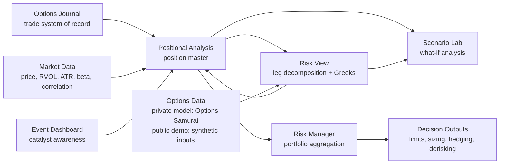
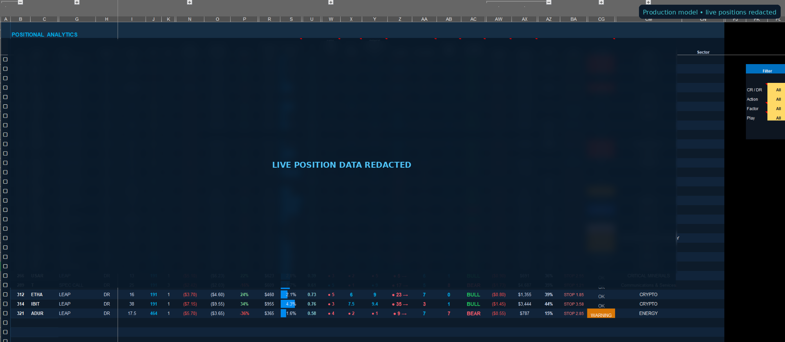
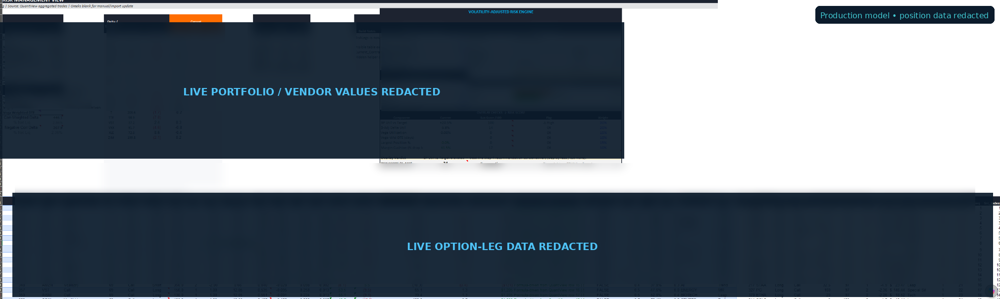
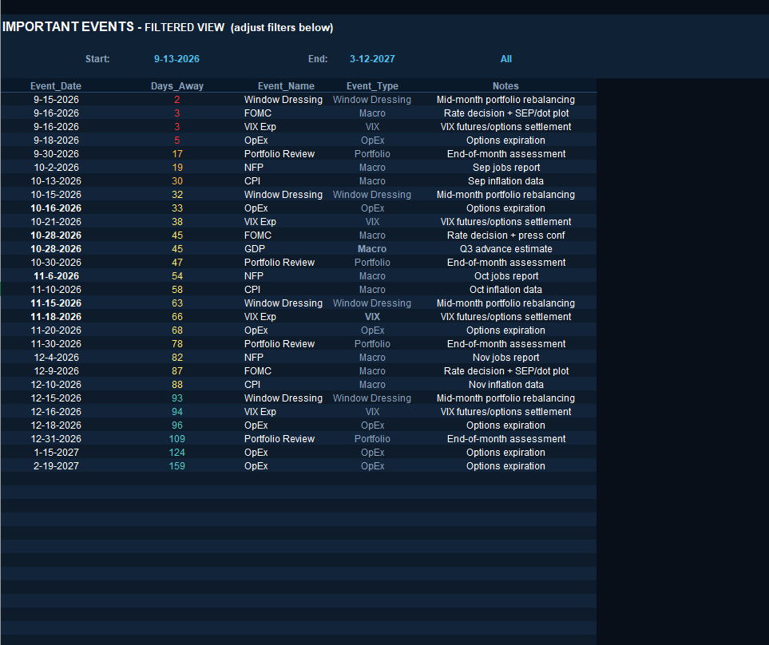
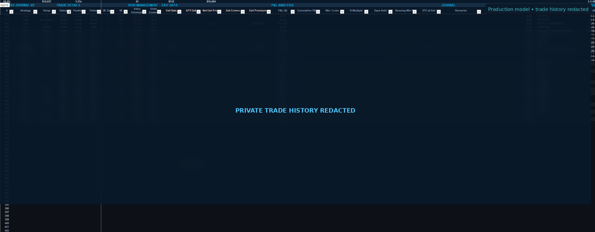
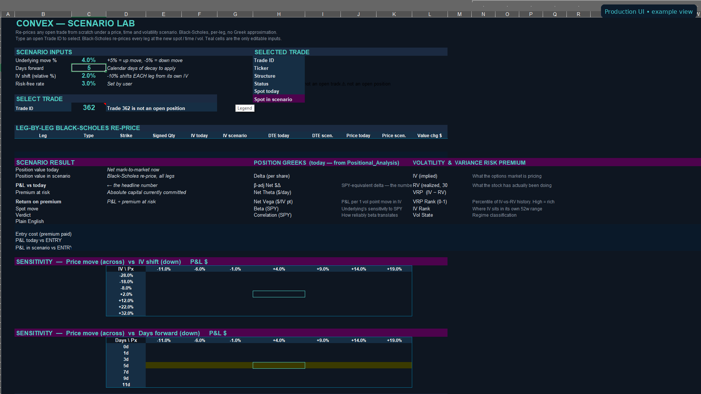
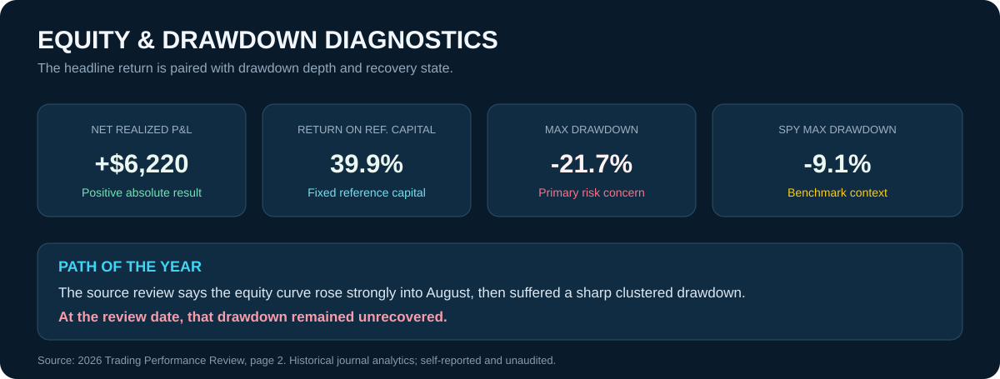
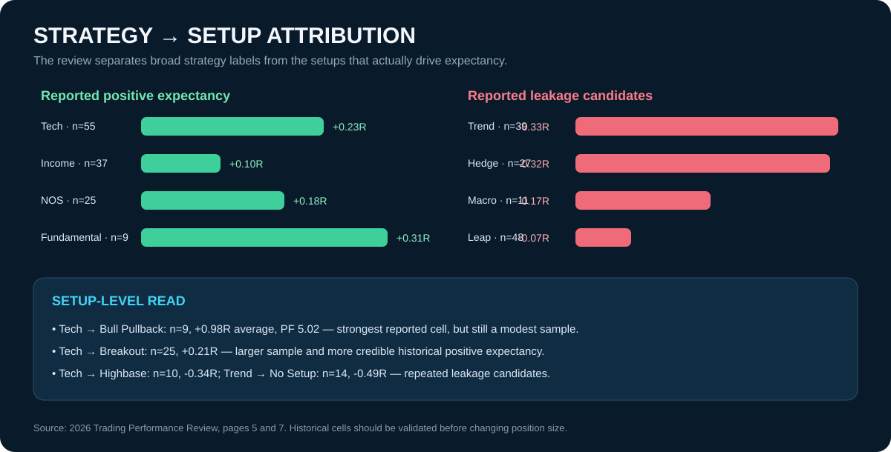
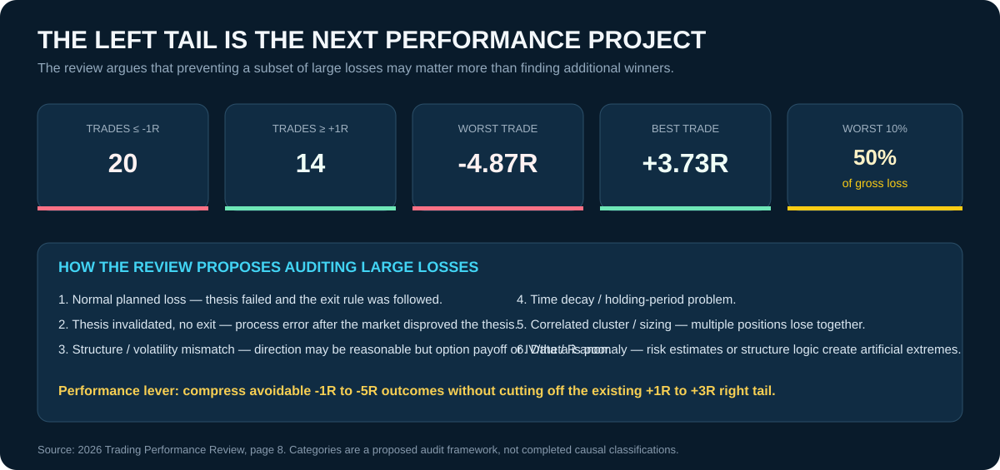

# CONVEX Portfolio Manager

**Options portfolio risk and decision-support system built from a discretionary trading workflow.**

> **Portfolio project:** CONVEX began as a private Excel-based portfolio-management system designed to translate option positions into leg-level Greeks, position analytics, portfolio exposures, risk limits, scenario analysis, and management signals. This repository contains a **public synthetic demonstration workbook** using a fictional **$100,000 portfolio**. The demo workbook and demo screenshots are synthetic. A separate **2026 Trading Performance Review** uses historical trading-journal data to evaluate the decision process after trades close; those review figures are self-reported and unaudited and are clearly separated from the synthetic demo.



## Why I built it

Broker platforms are good at showing positions and P&L, but I wanted a framework that answered different questions:

- What am I actually exposed to after decomposing multi-leg positions?
- How much directional, volatility, theta, gamma, factor, and concentration risk is in the book?
- Which positions are consuming risk inefficiently?
- When should a position be held, rolled, trimmed, overlaid, or closed?
- How should portfolio deployment change as volatility changes?

CONVEX was built to turn those questions into a repeatable analytical workflow.
##
### 📥 Download the Working Excel Demo

**[Download CONVEX Portfolio Manager — Excel Demo](CONVEX_Portfolio_Manager_Demo.xlsx)**

Explore the synthetic $100,000 portfolio, modify inputs, and inspect the quantitative risk models.

### 📖 Operating Guide & Methodology

**[Read the CONVEX Operating Guide (PDF)](CONVEX_Portfolio_Manager_Operating_Guide.pdf)**

A detailed walkthrough of how I use CONVEX, including trade entry, position analysis, options Greeks, portfolio risk calculations, quantitative formulas, scenario analysis, and position-management decisions.
##

## System architecture



The original model contains a deliberate two-way dependency between **Positional Analysis** and **Risk View**: position identity and structure flow down to the leg engine, while leg-level prices and Greeks flow back up for position and portfolio aggregation.

## Core workflow

1. **Record the trade** in the journal.
2. **Select the live book** and classify each position.
3. **Explode multi-leg structures** into individual option legs.
4. **Attach pricing and Greeks** to each leg.
5. **Aggregate leg risk** back to the position level.
6. **Calculate position analytics** including volatility, probability, trend, premium efficiency, and management levels.
7. **Aggregate the portfolio** into directional, volatility, factor, concentration, margin, and sizing views.
8. **Generate decision support** such as `OK`, `CAUTION`, `WARNING`, `ROLL`, `OVERLAY`, `CLOSE`, and derisking priorities.

## Synthetic demonstration views

The screenshots in this subsection come from the public demonstration copy of CONVEX. **Every position and account value shown in these demo views is fictional.** The separate 2026 performance-review section below is journal-derived historical analysis and is explicitly labeled as self-reported and unaudited.

### Position analytics



The position layer combines trade structure, DTE, P&L, volatility state, momentum/trend measures, skew/IV information, Greeks, portfolio factor tags, management levels, and rule-based action outputs.

### Leg decomposition and Greek aggregation



Risk View converts position-level option structures into individual legs, applies signed quantities, attaches option Greeks, and aggregates the results into ticker- and portfolio-level exposure measures.

### Event awareness



The event dashboard maintains a forward calendar of macro, options-expiration, volatility, and portfolio-review events. Event proximity can feed back into position-management rules.

<details>
<summary>Additional demo screenshots</summary>

### Trade journal



### Scenario lab



</details>

## 2026 Trading Performance Review

The performance-review layer closes the CONVEX feedback loop: the portfolio system measures current exposure and position risk, while the journal review asks whether completed trades are producing repeatable outcomes.

> **Performance disclosure:** The figures below come from the supplied 2026 trading-journal review. They are historical, self-reported and unaudited. They are **not** part of the synthetic demo, have not been reconciled to brokerage statements in this repository, and should not be interpreted as audited investment performance.


The review reports **+$6,220 net realized P&L**, **39.9% return on fixed reference capital**, **284 closed trades**, a **1.20 profit factor**, and a **-21.7% maximum drawdown**.



The headline return is paired with the path of the year: the review describes a strong rise into August followed by a sharp clustered drawdown that remained unrecovered at the review date. This is why the performance layer is presented as a diagnostic system rather than a return summary.


Among the 259 trades with an R estimate, mean R is **-0.03R** and median R is **-0.01R**. Positive dollar performance therefore coexists with a much flatter risk-normalized trade distribution.



The review drills below broad strategy labels into setup-level expectancy. Reported pockets of positive expectancy include Tech and Income; Trend and Hedge are flagged for further investigation. At setup level, Tech → Bull Pullback and Tech → Breakout are stronger historical cells, while Tech → Highbase and several other combinations are treated as leakage candidates.



The next performance project is loss control rather than simply increasing activity: the review records **20 trades at or below -1R** versus **14 at or above +1R**, and proposes auditing large losses by thesis invalidation, option-structure/volatility mismatch, time decay, correlated sizing and data-quality issues.

**[Read the full 2026 performance-review analysis](performance-review.md)**

## Quantitative components

The larger implementation includes:

- multi-leg option ticket parsing and signed-leg construction
- delta, theta, vega, and gamma aggregation
- dollar delta and beta-adjusted dollar delta
- DTE-matched realized volatility
- ATR and standardized volatility/trend measures
- beta and correlation versus SPY
- implied-versus-realized volatility measures
- probability-of-profit approximation
- volatility-regime classification
- volatility-targeted deployment
- inverse-volatility factor sizing
- concentration and factor exposure analysis
- rule-based position management
- derisking / cut-list prioritization
- portfolio stress scenarios
- fractional Kelly-based position sizing
- Black-Scholes scenario repricing

See [`methodology.md`](methodology.md) for the methodology overview.

## Working demo

The downloadable workbook is here:

**[`CONVEX_Portfolio_Manager_Demo.xlsx`](CONVEX_Portfolio_Manager_Demo.xlsx)**

The workbook uses a **synthetic $100,000 portfolio** so it can be shared publicly without exposing brokerage information, live trades, or licensed third-party market data. It demonstrates the production-style workflow and analytical logic.

## Data sources

The private workbook uses Microsoft Excel market-data functionality for underlying price history and, where available, **Options Samurai** for option-level pricing, Greeks, implied volatility, and related option statistics.

Those vendor values are **not redistributed in this repository**. The public demo uses synthetic/demo inputs.

## What this project demonstrates

This project is intended to demonstrate my ability to:

- translate a trading process into a structured analytical system
- connect transaction-level data to position- and portfolio-level risk
- design quantitative decision rules rather than rely only on visual dashboards
- work with option Greeks and multi-leg structures
- build auditable models in Excel using dynamic arrays and formula-driven logic
- identify model limitations and data-quality risks
- communicate a complex analytical workflow clearly
- evaluate closed-trade quality through R-multiples, drawdown, setup attribution, loss-tail analysis, and process feedback

I built CONVEX as a **self-directed project**. It should not be interpreted as institutional software, audited risk infrastructure, or investment advice.

## Known limitations

- the public workbook uses synthetic rather than live option data
- some management thresholds are research hypotheses / practitioner rules rather than statistically validated findings
- the production stress framework is simplified relative to a full nonlinear portfolio simulation
- the current implementation is Excel-first and contains logic that would be easier to test and version-control in Python
- the private model relies on external data availability
- the 2026 performance review is self-reported and unaudited; some closed trades lack an R estimate, and the current R definition is capital-R rather than planned-stop R

A fuller discussion is available in [`limitations.md`](limitations.md).

## Next development stage

The natural next step is to move selected engines from spreadsheet formulas into Python, beginning with:

1. multi-leg structure parsing
2. pricing and Greek calculations
3. rolling realized-volatility statistics
4. portfolio exposure aggregation and limits
5. point-in-time state storage for reproducible testing

That would create a progression from **spreadsheet prototype → documented model → testable analytics code → interactive application**.

## Repository structure

```text
Convex-Portfolio-Manager/
├── README.md
├── CONVEX_Portfolio_Manager_Demo.xlsx
├── architecture.md
├── methodology.md
├── limitations.md
├── risk-manager.png
├── risk-view.png
├── positional-analysis.png
├── event-dashboard.png
├── performance-review.md
├── performance-review-scorecard.svg
├── performance-equity-drawdown.svg
├── performance-review-r-distribution.svg
├── performance-setup-attribution.svg
├── performance-left-tail.svg
├── trade-journal.png
├── scenario-lab.png
└── .gitignore
```

---

**Disclaimer:** This repository is an analytical portfolio project for demonstration and research purposes only. The public demo portfolio and its position screenshots are synthetic. The separate 2026 performance review is journal-derived, self-reported historical analysis and is unaudited. Nothing in this repository is financial advice, a recommendation to trade, or a production risk-management system.
