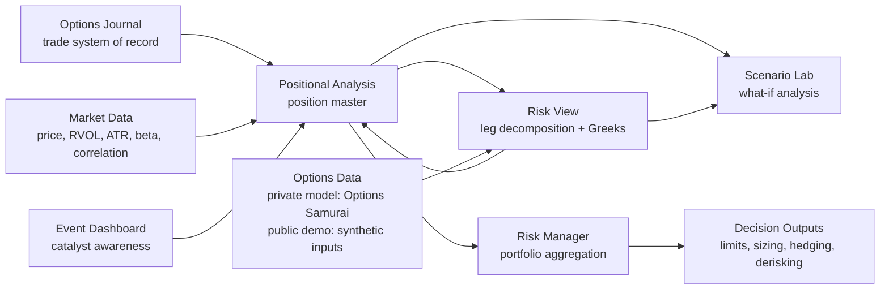

# CONVEX Portfolio Manager

**Options portfolio risk and decision-support system built from a discretionary trading workflow.**

> **Portfolio project:** CONVEX began as a private Excel-based portfolio management system used to translate option positions into leg-level Greeks, position analytics, portfolio exposures, risk limits, scenario analysis, and management signals. This repository contains a **sanitized, self-contained demonstration workbook** plus documentation of the larger private implementation.


## Why I built it

Broker platforms are good at showing positions and P&L, but I wanted a framework that answered different questions:

- What am I actually exposed to after decomposing multi-leg positions?
- How much directional, volatility, theta, gamma, factor, and concentration risk is in the book?
- Which positions are consuming risk inefficiently?
- When should a position be held, rolled, trimmed, overlaid, or closed?
- How should portfolio deployment change as volatility changes?

CONVEX was built to turn those questions into a repeatable analytical workflow.

## System architecture



The original model contains a deliberate two-way dependency between **Positional Analysis** and **Risk View**: position identity and structure flow down to the leg engine, while leg-level prices and Greeks flow back up for position and portfolio aggregation.

## Core workflow

1. **Record the trade** in the journal.
2. **Select the live book** and classify each position.
3. **Explode multi-leg structures** into individual option legs.
4. **Attach pricing and Greeks** to each leg.
5. **Aggregate leg risk** back to the position level.
6. **Calculate position analytics** including volatility, probability, trend, premium efficiency, and management levels.
7. **Aggregate the portfolio** into directional, volatility, factor, concentration, margin, and sizing views.
8. **Generate decision support** such as `OK`, `CAUTION`, `WARNING`, `ROLL`, `OVERLAY`, `CLOSE`, and derisking priorities.

## Selected production views

The screenshots below come from the larger private model. Live trades, account values, and other sensitive values have been redacted. The downloadable workbook in this repository is the sanitized demo implementation.

### Position analytics


The position layer combines trade structure, DTE, P&L, volatility state, momentum/trend measures, skew/IV information, Greeks, portfolio factor tags, management levels, and rule-based action outputs.

### Leg decomposition and Greek aggregation


The Risk View converts position-level option structures into individual legs, applies signed quantities, attaches option Greeks, and aggregates the results into ticker- and portfolio-level exposure measures.

### Event awareness


The event dashboard maintains a forward calendar of macro, options-expiration, volatility, and portfolio-review events. In the private model, event proximity can feed back into position-management rules.

### Historical trade analytics


Historical trades are grouped by strategy, structure, DTE, and time utilized to evaluate where the trading process has and has not added value. Historical values are redacted in the public screenshot.

<details>
<summary>Additional production screenshots</summary>

### Trade journal


### Scenario lab


</details>

## Quantitative components

The larger private implementation includes:

- multi-leg option ticket parsing and signed-leg construction
- delta, theta, vega, and gamma aggregation
- dollar delta and beta-adjusted dollar delta
- DTE-matched realized volatility
- ATR and standardized volatility/trend measures
- beta and correlation versus SPY
- implied-versus-realized volatility measures
- probability-of-profit approximation
- volatility-regime classification
- volatility-targeted deployment
- inverse-volatility factor sizing
- concentration and factor exposure analysis
- rule-based position management
- derisking / cut-list prioritization
- portfolio stress scenarios
- fractional Kelly-based position sizing
- Black-Scholes scenario repricing

See [`docs/methodology.md`](docs/methodology.md) for the methodology overview.

## Working demo

The downloadable workbook is here:

**[`demo/CONVEX_Portfolio_Manager_Demo.xlsx`](demo/CONVEX_Portfolio_Manager_Demo.xlsx)**

The demo uses **synthetic portfolio and option data** so it can be shared publicly without exposing brokerage information, live trades, or licensed third-party market data. It is designed to demonstrate the workflow and analytical logic rather than reproduce every production feature one-for-one.

### Demo sheets

| Sheet | Purpose |
|---|---|
| `START_HERE` | Project overview and workflow |
| `CONFIG` | Centralized demo assumptions and risk settings |
| `Options_Journal` | Synthetic trade-entry system of record |
| `Demo_Market_Data` | Synthetic underlying statistics |
| `Option_Data_Demo` | Synthetic option-price and Greek inputs |
| `Risk_View` | Multi-leg decomposition and Greek aggregation |
| `Positional_Analysis` | Position-level metrics and management signals |
| `Event_Dashboard` | Catalyst calendar |
| `Risk_Manager` | Portfolio-level risk dashboard |
| `Scenario_Lab` | Price / time / volatility scenario analysis |

## Data sources

The private workbook uses Microsoft Excel market-data functionality for underlying price history and, where available, **Options Samurai** for option-level pricing, Greeks, implied volatility, and related option statistics.

Those vendor values are **not redistributed in this repository**. The public demo substitutes synthetic inputs.

## What this project demonstrates

This project is intended to demonstrate my ability to:

- translate a trading process into a structured analytical system
- connect transaction-level data to position- and portfolio-level risk
- design quantitative decision rules rather than rely only on visual dashboards
- work with option Greeks and multi-leg structures
- build auditable models in Excel using dynamic arrays and formula-driven logic
- identify model limitations and data-quality risks
- communicate a complex analytical workflow clearly

I built CONVEX as a **self-directed project**. It should not be interpreted as institutional software, audited risk infrastructure, or investment advice.

## Known limitations

The private workbook and public demo both have intentional limitations. Among them:

- the public workbook uses synthetic rather than live option data
- some management thresholds are research hypotheses / practitioner rules rather than statistically validated findings
- the production stress framework is simplified relative to a full nonlinear portfolio simulation
- the current implementation is Excel-first and contains logic that would be easier to test and version-control in Python
- the private model relies on external data availability

A fuller discussion is available in [`docs/limitations.md`](docs/limitations.md).

## Next development stage

The natural next step is to move selected engines from spreadsheet formulas into Python, beginning with:

1. multi-leg structure parsing
2. pricing and Greek calculations
3. rolling realized-volatility statistics
4. portfolio exposure aggregation and limits
5. point-in-time state storage for reproducible testing

That would create a clean progression from **spreadsheet prototype → documented model → testable analytics code → interactive application**.

## Repository structure

```text
convex-portfolio-manager/
├── README.md
├── demo/
│   └── CONVEX_Portfolio_Manager_Demo.xlsx
├── images/
│   ├── risk-manager.png
│   ├── risk-view.png
│   ├── positional-analysis.png
│   ├── event-dashboard.png
│   ├── historical-performance.png
│   ├── trade-journal.png
│   └── scenario-lab.png
├── docs/
│   ├── architecture.md
│   ├── methodology.md
│   └── limitations.md
└── .gitignore
```

---

**Disclaimer:** This repository is an analytical portfolio project for demonstration and research purposes only. It is not financial advice, a recommendation to trade, or a production risk-management system.
