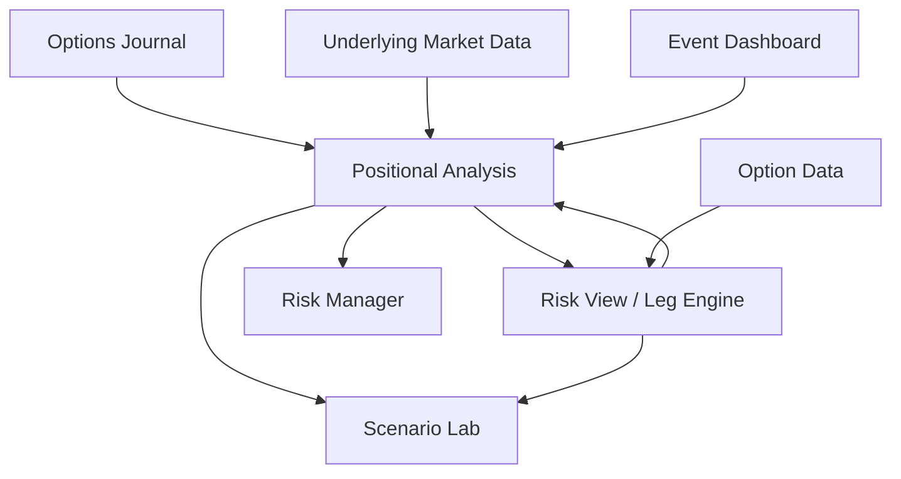

# Architecture

## Overview

CONVEX is organized as a layered analytical pipeline rather than a single dashboard. The original workbook separates trade entry, market data, option-leg construction, position analytics, portfolio aggregation, event awareness, and scenario analysis.

## 1. Journal layer

The journal is the system of record. A trade is represented at the position level with fields such as strategy, status, ticker, structure, strike ticket, entry/expiry dates, quantity, premium, exit information, notes, and portfolio factor tags.

A live-book selector filters open trades and passes the relevant positions into the analytical layer.

## 2. Position layer

`Positional_Analysis` is the position master. It combines journal data with underlying statistics and leg-level option data. It is responsible for:

- normalizing option structures into play types
- tracking DTE, entry/current premium, open P&L and premium held
- volatility and trend classification
- probability / volatility-ratio measures
- dollarized Greeks and beta-adjusted exposure
- stop, floor, cap, overlay, roll, and close logic
- derisking priority

## 3. Leg engine

`Risk_View` decomposes a multi-leg position into individual legs. In the private workbook, free-text strike tickets are parsed into strikes and multipliers, then each leg receives:

- option type
- long/short side
- strike
- signed contract quantity
- option price
- delta
- theta
- vega
- gamma
- implied volatility / skew inputs

Leg-level risk is then aggregated back to the trade identifier.

## 4. Portfolio aggregation

`Risk_Manager_v2` aggregates the live book into portfolio-level measures such as:

- net and gross dollar delta
- beta-adjusted dollar delta
- theta and vega
- factor concentration
- notional exposure
- buying-power utilization
- risk limits and headroom
- volatility-targeted premium deployment
- hedge sizing
- factor-level risk contribution

The goal is not simply to display risk, but to convert risk into a management action.

## 5. Event awareness

The event dashboard maintains a dated event set and generates countdowns. The private model can use event proximity as a gate in management rules—for example, avoiding an option overlay when a known catalyst is approaching.

## 6. Scenario analysis

The Scenario Lab provides a separate what-if layer. It is designed to reprice an option position across changes in:

- underlying price
- time to expiry
- implied volatility

The private model uses Black-Scholes-style repricing for the scenario engine rather than relying only on first-order Greek approximations.

## Public demo architecture

The public workbook preserves the same conceptual pipeline but replaces sensitive and licensed data with synthetic inputs. It is intentionally smaller and easier to inspect.
