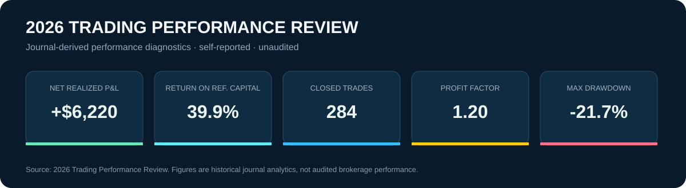
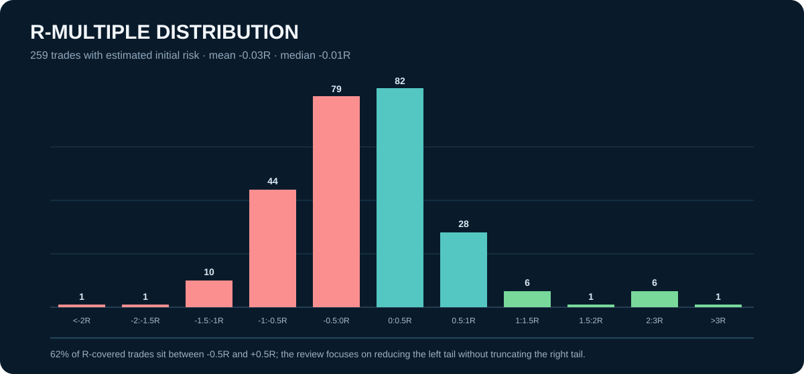

# 2026 Trading Performance Review

**CONVEX trade-review layer · journal-derived historical analytics · self-reported and unaudited**

[← Back to CONVEX Portfolio Manager](README.md)

The 2026 performance review is the feedback loop of the CONVEX system. The synthetic demo shows how the portfolio-management architecture works; this review shows how the trading journal is used to diagnose the *process after trades close* — separating dollar profitability from risk-normalized expectancy, locating strategy/setup edge, measuring drawdown, and identifying where loss control can improve the distribution.

> **Important distinction:** the public CONVEX demo workbook and its position screenshots are synthetic. The figures on this page come from the supplied 2026 trading-journal review. They are historical, self-reported, unaudited, and have not been reconciled to brokerage statements in this repository.

## What the review establishes

The report records **+$6,220 net realized P&L**, **39.9% return on fixed reference capital**, **284 closed trades**, a **1.20 profit factor**, and a **-21.7% maximum drawdown**. The dollar result is positive, but the risk-normalized distribution is much less uniform: 259 trades have an R estimate, with mean R of **-0.03R** and median R of **-0.01R**.

That gap is analytically useful. It prevents the system from treating a positive P&L number as sufficient evidence that every part of the process has positive expectancy.

## Strategy and setup attribution

The review separates broad strategy labels from the setups inside them. Reported examples include:

- **Tech:** n=55, PF 1.93, +0.23R expectancy.
- **Income:** n=37, PF 3.37, +0.10R expectancy.
- **Tech → Bull Pullback:** n=9, +0.98R average, PF 5.02; strong result but still a modest sample.
- **Tech → Breakout:** n=25, +0.21R; a larger sample with positive reported expectancy.
- **Trend:** n=39, -0.33R expectancy.
- **Hedge:** n=27, -0.32R expectancy.
- **Tech → Highbase:** n=10, -0.34R; a repeated leakage candidate.

The purpose is not to mechanically scale the highest historical cell. It is to identify which combinations deserve additional validation and which repeated losses deserve investigation before more capital is allocated.

## Why positive dollars can coexist with negative average R

The review identifies three reasons:

1. **Different populations.** Twenty-five closed trades have no R estimate; those trades contributed +$2,375 and therefore affect dollar P&L but not the R distribution.
2. **Unequal position sizing.** The review reports higher average risk on positive-expectancy setups than on negative-expectancy setups, so sizing can influence dollar results even when average R is flat.
3. **Winner concentration.** The top five winners contributed +$7,682 — more than the reported annual net P&L — which means the durability of the result depends heavily on whether those larger winners came from repeatable setups.

## The left tail is the main performance project

The review records **20 trades at or below -1R** versus **14 trades at or above +1R**, with a worst trade of **-4.87R** and a best trade of **+3.73R**. It also reports that the worst 10% of trades account for roughly half of gross losses.

That turns the next research question from “how do I find more trades?” into “how much can the distribution improve if avoidable large losses are reduced without truncating the winners?”

The proposed loss audit classifies large losses into normal planned losses, thesis-invalidated/no-exit errors, structure or volatility mismatches, time-decay/holding-period problems, correlated sizing clusters, and data/R anomalies.

## Trade-management feedback loop

A key process change is to distinguish the **thesis stop** from the **capital stop**:

- define the underlying thesis invalidation before entry;
- exit or adjust when the thesis is no longer true;
- retain the current -50% debit-premium rule as a hard capital backstop while the loss audit is performed;
- use a **Trade Group ID** to connect monetization or hedge legs to the same economic thesis without losing leg-level Greeks and P&L.

This extends CONVEX from a risk dashboard into a process-audit system: the portfolio layer measures what the book owns; the performance layer asks whether the decision rules are producing repeatable outcomes.

## Next review sequence

The report's proposed sequence is to audit the 20 trades below -1R, quantify overlap across losing categories, separate thesis quality from option-structure quality, build a regime playbook only from adequately sampled cells, and develop risk-tier sizing only after the edge/leakage map is clearer.

**R-definition caveat:** the current review uses *capital R* — Net P&L divided by estimated initial/max risk — rather than planned-stop R. For debit options, those concepts can differ materially. That makes the proposed invalidation and planned-risk fields important before treating R as a fully standardized process metric.

---

**Research/performance disclosure:** This is a retrospective analysis of journal data for process improvement. It is not audited performance, a brokerage statement, or a recommendation to trade. Historical setup statistics may not persist.
